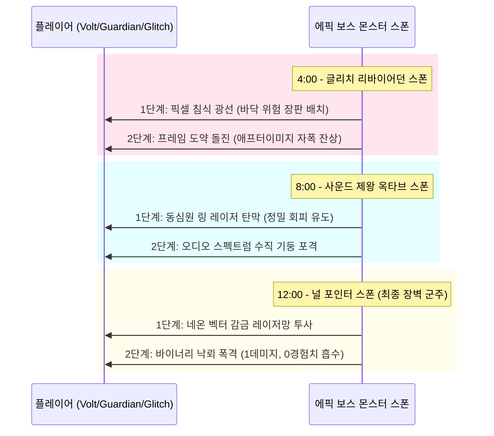

# [PRD] Neon Survivors: 신규 무기 확장 및 에픽 보스 시스템 기획서

이 문서는 레트로 신스웨이브 탑다운 탄막 슈터 **Neon Survivors**의 중장기 플레이 깊이와 전략성을 극대화하기 위해 제안된 **신규 무기 4종 / 초월(진화) 무기 4종** 및 **에픽 보스 몬스터 3종**의 기획 사양 및 기술 구현 요구사항을 정의합니다.

---

## 1. 개요 (Overview)
*   **문서 유형**: 기능 확장 제품 요구사항 정의서 (PRD)
*   **작성 대상**: 신규 무기 시스템, 초월(진화) 조합 엔진, 보스 몬스터 패턴 AI
*   **핵심 목표**:
    1.  **전략적 선택지 다양화**: 유기적인 공격 스타일(음파 넉백, 프리즘 굴절, 중력 제어, 해킹 바이러스)을 제공하여 다회차 플레이 시 빌드 구성의 다변화 확보.
    2.  **도전 욕구 자극 (에픽 보스)**: 단순 돌진 패턴을 벗어나 탄막 슈터 본연의 손맛을 극대화하는 탄막 패턴 및 독창적인 패턴 AI를 갖춘 전용 보스 몬스터 구현.
    3.  **신스웨이브 시각 연출 극대화**: 실시간 이퀄라이저, 픽셀 글리치 왜곡, 분광 굴절 등 고품질의 Canvas 파티클 시각 피드백 추가.

---

## 2. 신규 무기 및 초월(진화) 조합 엔진 사양

기존 무기군 외에 전술적인 유틸리티성(넉백, 홀딩, 굴절, 아군 부활)을 보유한 기본 무기 4종과 그에 상응하는 초월 무기를 추가합니다.

### 2.1. 기본 무기 4종 상세 요구사항

#### 1. 🎧 레트로 신스 웨이브 (Retro Synth Wave)
*   **공격 형태**: 플레이어 중심 360도 전 방향 팽창 원형 음파 펄스.
*   **동작 방식**: 일정 주기마다 확장되는 보라색 네온 음파 고리를 발사하여 적들에게 강한 **넉백(Knockback)**과 미세한 경직을 줍니다. 넉백된 적이 벽에 닿으면 추가 충돌 피해를 입습니다.
*   **레벨업 스탯**:
    *   *Lv.1*: 플레이어 중심 음파 펄스 주기적 방출.
    *   *Lv.2*: 음파 팽창 속도 및 최대 반경 $+25\%$ 증가.
    *   *Lv.3*: 파동이 연속 2회 연속 방출되는 이중 펄스 장착.
    *   *Lv.4*: 음파 범위에 휩쓸린 적의 이동 속도를 3초간 $40\%$ 감소시키는 감속 디버프 추가.
    *   *Lv.5*: 3연속 펄스 및 기본 넉백 저항을 $30\%$ 무시하는 초고파동 장착.

#### 2. 🕳️ 양자 보이드 균열 (Quantum Void Rift)
*   **공격 형태**: 적들 무리 속에 생성되는 지속 흡입성 미세 블랙홀.
*   **동작 방식**: 화면 내 적이 가장 밀집된 영역을 타겟팅하여 퍼플 네온 소용돌이를 생성합니다. 3초간 주변의 소형/보통 몹을 서서히 중심으로 끌어당기며 지속 도트 데미지를 줍니다.
*   **레벨업 스탯**:
    *   *Lv.1*: 3초 지속되는 소형 보이드 균열 1개 소환.
    *   *Lv.2*: 균열 개수 2개로 증가 (동시 소환).
    *   *Lv.3*: 흡입력(Pull Force) $+30\%$ 강화 및 도트 데미지 간격 단축.
    *   *Lv.4*: 소용돌이가 수명이 다해 소멸하는 순간 중심에서 압축 폭발 피해 발산.
    *   *Lv.5*: 균열 개수 3개로 증가 및 최종 압축 폭발 반경 $+40\%$ 확장.

#### 3. 💎 프리즘 굴절기 (Prismatic Beam)
*   **공격 형태**: 적들 사이를 징검다리처럼 꺾여 나가는 광굴절 지그재그 레이저.
*   **동작 방식**: 정면(또는 가장 가까운 적)을 향해 뻗어나가 관통 피해를 주는 빔을 쏘며, 적 충돌 시 가장 가까운 주변 적을 향해 빛이 자동으로 꺾여 번져 나갑니다.
*   **레벨업 스탯**:
    *   *Lv.1*: 최대 3회 굴절 전이되는 단일 관통 레이저 발사.
    *   *Lv.2*: 레이저 빔 구경 굵기 증가 및 최대 굴절 횟수 5회로 확장.
    *   *Lv.3*: 레이저 발사 개수 증가 (플레이어 양방향으로 2갈래 조사).
    *   *Lv.4*: 굴절 전이 시 데미지가 감소하지 않고 오히려 매 전이마다 피해량이 $+10\%$씩 증폭.
    *   *Lv.5*: 3갈래 분광 레이저 동시 발사 및 최대 굴절 전이 8회로 팽창.

#### 4. 👾 나노 바이러스 포자 (Nanite Infector)
*   **공격 형태**: 플레이어 주변에 방출되어 부유하는 가상 바이러스 안개.
*   **동작 방식**: 닿은 적을 '해킹 감염' 시켜 지속 피해를 주며 이동 속도를 $20\%$ 저하시킵니다.
*   **레벨업 스탯**:
    *   *Lv.1*: 무작위 부유 포자 안개 4개 주기적 살포.
    *   *Lv.2*: 포자 개수 7개로 증가 및 지속 시간 $+20\%$ 연장.
    *   *Lv.3*: 감염 데미지 간격 절반으로 단축.
    *   *Lv.4*: 감염 상태로 사망한 적이 폭발하며 주변 적 3명에게 즉시 감염 전파.
    *   *Lv.5*: 감염 전파 전이 횟수 무제한 해제 및 감염된 적의 방어력 $50\%$ 경감 디버프 추가.

---

### 2.2. 초월(진화) 무기 합성 메커니즘
기본 무기 Lv.5 달성 및 핵심 조합용 패시브 아이템 장착 완료 상태에서, 엘리트 또는 보스 처치 시 등장하는 **에볼루션 코어(Evolution Core)** 획득 시 퓨전 합성 전이가 발생합니다.

```
[기본 무기 Lv.5] + [필수 시너지 패시브 Lv.1 이상] + [에볼루션 코어 획득] ➡️ 궁극의 초월 무기로 승화
```

#### 💿 1. 서브우퍼 오디오 스펙트럼 (Subwoofer Resonance Grid)
*   **융합 레시피**: **레트로 신스 웨이브 (Lv.5)** + **강력 자석 패시브 (Lv.1+)**
*   **시각 연출**: 플레이어 주변에 네온 핑크/시안 컬러의 가상 실시간 주파수 이퀄라이저 파동(Audio Equalizer Wave)이 음악 템포에 맞춰 퍼져나갑니다.
*   **전투 사양**: 플레이어 주변 반경 180px 영역에 **상시 파동 공명장**을 유지합니다. 적들은 영역에 발을 디디는 순간 지속 넉백과 함께 방어력이 영구 감쇄되며, 공명장 안쪽으로 밀려올수록 압도적으로 중첩되는 저주파 진동 파쇄 피해를 입습니다.

#### 🧬 2. 사건의 지평선 글리치 (Event Horizon Glitch)
*   **융합 레시피**: **양자 보이드 균열 (Lv.5)** + **부스터 신발 패시브 (Lv.1+)**
*   **시각 연출**: 거대한 사이버 퍼플 블랙홀 주변으로 가상 세계의 **0과 1 디지털 바이너리 코드 입자**들이 강력하게 소용돌이치며 빨려 들어가다가, 스크린이 지지직거리는 화면 글리치 효과와 함께 폭발합니다.
*   **전투 사양**: 맵 전체에서 적이 가장 밀집된 지점에 메가 블랙홀을 형성합니다. 모든 엘리트 이하 적들을 강제로 견인하며, 흡입 도중 압사한 적들은 체인 리액션 폭발을 일으키고, 마지막 최종 붕괴 폭발 시 생존한 적들을 3초간 코딩이 일시정지된 먹통 상태(Freeze)로 고정시킵니다.

#### 🌟 3. 초신성 레인보우 프리즘 (Prism Cascade Overlord)
*   **융합 레시피**: **프리즘 굴절기 (Lv.5)** + **오버차지 리액터 패시브 (Lv.1+)**
*   **시각 연출**: 플레이어를 관통하여 화면 좌우/상하 끝까지 이어지는 4갈래 굵직한 무지개 분광 스펙트럼 레이저 기둥이 회전 전개됩니다.
*   **전투 사양**: 플레이어의 조작 방향에 관계없이 4연장 메가 빔이 시계 방향으로 상시 회전하며 전장을 휩씁니다. 레이저 빔이 적의 외골격이나 아레나의 네온 경벽(벽면)에 부딪힐 때마다, 사방으로 무작위 굴절 튕김 효과를 일으키는 미세 유도 분광 구체 10여 발이 튀어나와 사방을 도배합니다.

#### 💀 4. 가상 좀비 네트워크 (Cybernetic Zombie Overlord)
*   **융합 레시피**: **나노 바이러스 포자 (Lv.5)** + **나노 아머 패시브 (Lv.1+)**
*   **시각 연출**: 좀비화 해킹이 적용된 적들의 머리 위로 형광 네온 그린 컬러의 **디지털 해킹 마크(💀)**가 점멸하며, 아군으로 식별되는 고유 네온 아웃라인을 띄게 됩니다.
*   **전투 사양**: 바이러스에 걸려 쓰러진 모든 적이 죽지 않고, 플레이어를 경호하는 **해킹 좀비 디바이스**로 즉시 부활(강제 동기화)합니다. 아군이 된 적들은 주변의 다른 적들에게 돌진하여 몸통 박치기 피해를 주며 어그로를 분산시킵니다. 부활 후 5초가 지나거나 소멸 시, 바이러스를 사방에 흩뿌리는 자폭 폭발을 일으켜 2차 아군 바이러스 감염망을 전파시킵니다.

---

## 3. 에픽 보스 몬스터 시스템 사양

플레이 타임 기준 특정 타이밍에 단판성 돌격 몹 대신, 고유의 전술적인 탄막 패턴과 지형 왜곡 스킬을 지닌 에픽급 사이버 보스 3종이 등판합니다.



### 3.1. [Boss 1] 글리치 리바이어던 (Glitch Leviathan) - 프레임 파괴자
*   **등판 시간**: 4분 0초 (4:00)
*   **테마 컨셉**: 가상 세계의 파괴된 백터 데이터 조각들로 구성된 거대한 네온 지네/리바이어던 형상의 괴수. 온몸을 지지지직거리는 보라색 노이즈 글리치 이펙트가 흐릅니다.
*   **고유 탄막 및 패턴**:
    1.  **픽셀 침식 광선 (Pixel Corrupter Beam)**: 입에서 거대한 빔을 3초간 쏘아 전방을 휩씁니다. 이 빔이 훑고 지나간 격자 바닥은 **적색 디지털 노이즈 영역**으로 변하며, 플레이어가 이 타일에 닿으면 지속적으로 누적 헤비 피해를 입습니다.
    2.  **프레임 도약 돌진 (Frame-Skip Dash)**: 순간적으로 프레임 드랍이 일어난 듯 화면이 끊기며 전방으로 길게 초고속 질주합니다. 질주했던 경로에는 불안정한 **글리치 잔상 기둥** 6개가 남으며, 1초 뒤 순차적으로 커다란 파란 폭발을 일으킵니다.
    3.  **코드 랙 매트릭스 (Code Lag Matrix)**: 체력이 $50\%$ 이하로 떨어지면 포효하며 가상 세계의 지연 현상을 유도합니다. 5초간 플레이어의 이동 속도 및 탄환 발사 속도가 $30\%$ 강제 감속되는 "랙 디버프"를 겁니다.

### 3.2. [Boss 2] 사운드 제왕 옥타브 (Synth-Lord Octave) - 스펙트럼 마스터
*   **등판 시간**: 8분 0초 (8:00)
*   **테마 컨셉**: 아레나 위에 둥둥 떠다니는 거대한 거울 면체의 사이버 스컬(Skull). 주위를 거대한 아날로그 신시사이저 건반들이 궤도 비행하며 수호하고 있습니다.
*   **고유 탄막 및 패턴**:
    1.  **레조넌스 동심원 레이저 (Sonic Resonance Ring)**: 중심에서 퍼져나가는 거대한 동심원 모양의 레이저 링 탄막들을 연속 방출합니다. 링 사이사이의 빈 틈새(안전지대)가 좁아 정밀한 무빙 컨트롤로 레이저를 넘나들며 회피해야 합니다.
    2.  **오디오 스펙트럼 폭격 (Audio Spectrum Column)**: 맵 상단에서 바닥까지 실시간 음악 주파수에 맞춰 길쭉한 네온 빔 기둥(Visualizer Bar)들이 바닥으로 폭포수처럼 무수히 떨어져 내립니다. 기둥들은 바닥 경벽에 부딪힌 후 사방으로 분산되는 2차 탄환을 만듭니다.
    3.  **신스 신디사이저 포화 (Synthesizer Cascade)**: 건반들을 연주하듯 회전시키며, 플레이어의 움직임을 예측해 날아가는 고성능 유도성 네온 큐브 미사일 8발을 연사합니다.

### 3.3. [Boss 3] 최종 군주: 널 포인터 (The Grid Overlord - Null Pointer)
*   **등판 시간**: 12분 0초 (12:00)
*   **테마 컨셉**: 화면 중심부 아레나 격자 전체와 동기화된 파란색 디지털 거대 와이어 거미 모양의 최종 격자 제어자. 가슴에 새빨갛게 타오르는 널 포인터 결손 코어(Red Core)가 박혀 있습니다.
*   **고유 탄막 및 패턴**:
    1.  **벡터 그리드 감금망 (Vector Web Constraint)**: 맵 상에 거대한 격자형 붉은색 네온 레이저 그물을 투사합니다. 이 레이저 망은 플레이어가 지나갈 수 없는 **통행 금지 장벽** 역할을 하며, 플레이어를 가로 세로 300px 크기의 임의의 사각형 감금 공간에 고립시킨 채 폭격을 쏟아붓습니다.
    2.  **바이너리 강우 폭풍 (Binary Rain Storm)**: 하늘에서 무수히 많은 glowing 0과 1 디지털 숫자가 비처럼 쏟아집니다.
        *   **`1` 파티클**: 피격 시 플레이어의 체력을 깎아내는 물리 관통 피해를 줍니다.
        *   **`0` 파티클**: 피격 시 직접적인 피해는 없지만, 플레이어의 **경험치 게이지(XP)를 직접 강탈/흡수**하여 레벨업을 뒤로 늦춰버리는 특수 페널티를 부여합니다.
    3.  **코드 무력화 장벽 (Nullification Matrix)**: 체력이 $30\%$ 이하로 떨어지면 널 포인터 보호막을 전개합니다. 이 상태에서는 오직 **초월 무기(Hyper-Weapon)의 공격만 장벽을 뚫고 타격**할 수 있으며, 일반 무기의 발사체는 보호막에 닿는 순간 흡수/소멸되어 초월 무기 진화 완성을 강제하도록 유도합니다.

---

## 4. 기술적 ECS 아키텍처 및 구현 설계안

기존 `main.js`, `Weapon.js`, `Enemy.js` 모듈을 유기적으로 확장하여 신규 무기 로직과 보스 AI를 모듈화 형태로 완벽 탑재합니다.

### 4.1. 클래스 다이어그램 및 엔티티 확장 구조
```
                   +-------------------+
                   |     Weapon        |
                   +-------------------+
                             |
         +-------------------+-------------------+
         |                                       |
+-------------------+                   +-------------------+
|  PrismaticBeam    |                   |   EventHorizon    |
+-------------------+                   +-------------------+
| - refract(enemy)  |                   | - pullEnemies()   |
+-------------------+                   +-------------------+
                                                  |
                                        +-------------------+
                                        |    Enemy (Boss)   |
                                        +-------------------+
                                        | - isDetonating    |
                                        | - triggerPattern()|
                                        +-------------------+
```

### 4.2. 보스 몬스터 패턴 구동 FSM (Finite State Machine)
보스들의 인공지능 패턴 주기는 `Enemy.js` 내부에 전용 `bossStateTimer`를 두어 패턴 전환 루프를 안전하게 회전시킵니다.
```javascript
// Enemy.js 보스 행동 상태 머신 구현 예시
updateBossAI(dt, player) {
  this.bossPatternTimer -= dt;
  if (this.bossPatternTimer <= 0) {
    // 3가지 고유 패턴 중 무작위 패턴 활성화
    const patterns = ['beam', 'dash', 'lag'];
    this.currentPattern = patterns[Math.floor(Math.random() * patterns.length)];
    this.bossPatternTimer = 6.0; // 패턴당 6초 유지
    this.patternInitialized = false;
  }
  
  // 현재 활성화된 고유 상태별 궤적 및 파티클 전개
  this.executeCurrentPattern(dt, player);
}
```

---

## 5. 성공 지표 및 검증 시나리오 (Verification Plan)

### 5.1. 핵심 시나리오 테스트
1.  **초월 진화 엔진 퓨전 정합성**:
    *   레트로 신스 웨이브 Lv.5 + 강력 자석 패시브를 획득한 상태에서 메가 보스가 떨어트린 에볼루션 코어 획득 시, 즉시 기존 신스 웨이브 배열이 필터되고 `SubwooferResonanceGrid` 인스턴스로 교체 주입되는지 여부 검증.
2.  **보스 0/1 바이너리 포격 상태 영향**:
    *   최종 보스 널 포인터의 `0` 포격 피격 시 실제로 `player.takeDamage()`는 생략되나 `player.xp` 값이 깎이며 레벨 UI 바가 차감 피드백을 주는지 검증.
3.  **사건의 지평선 홀딩 물리 흡입 연산**:
    *   블랙홀 생성 시 `enemies.forEach`로 잡힌 적들에게 구심력 방향의 가속 벡터 물리 연산이 누락 없이 프레임마다 누적 가산되어 중심으로 안정 수렴하는지 검증.

### 5.2. 그래픽 퍼포먼스 기준
*   화면에 4연장 레인보우 프리즘 레이저와 동시에 80마리의 몬스터 와이어프레임이 그려질 때, Chrome 성능 모니터링 탭 기준 **50 FPS 이하로 드랍되지 않으며**, Canvas 메모리 힙 누수(Garbage Collection 지연)가 일어나지 않을 것을 성공 기준으로 정의합니다.
